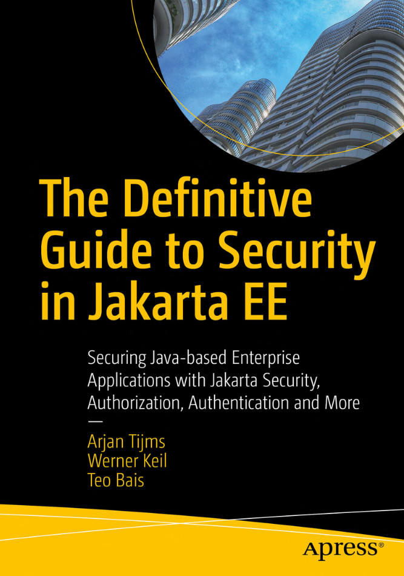

# Apress Source Code

This repository accompanies [*The Definitive Guide to Jakarta EE Security*](https://www.apress.com/%isbn%) by Arjan Tijms, Werner Keil, and Teo Bais (Apress, 2022).

[comment]: #cover

📫 **Available for sale** | Updates at 

Download the files as a zip using the green button, or clone the repository to your machine using Git.

## Requirements

To be able to execute 'mvn clean package -DskipTests' successfully you need Java 17.

While most chapters, except [chapter 5](chapter5-jakarta-security) also still run with Java 11.

## Releases

Release v1.0 corresponds to the code in the published book, without corrections or updates.

## Contributions

See the file Contributing.md for more information on how you can contribute to this repository.
